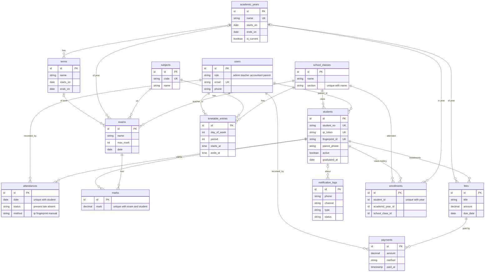

# قاعدة البيانات

23 جدولاً: 13 جدولاً للمدرسة، وجدول `users`، و9 جداول يضيفها Laravel (الجلسات، الطوابير، الكاش، التوكنات، سجل الـ migrations).
تُبنى كلها من ملفات `database/migrations/` بأمر واحد: `php artisan migrate`. اختُبر التطبيق على SQLite وPostgreSQL 16.

## قرارات التصميم

| القرار | السبب |
|---|---|
| جدول `users` واحد مع عمود `role` | أربعة أدوار بصلاحيات بسيطة. ولي الأمر مستخدم عادي، والطالب يرتبط به بـ `students.parent_id`. |
| `students.parent_phone` منفصل عن `users.phone` | رسائل واتساب تحتاج رقماً حتى لو لم يكن لولي الأمر حساب. `Student::notifyPhone()` يفضّل رقم الطالب ثم رقم الحساب. |
| `qr_token` عشوائي (48 حرفاً) وليس رقم الطالب | البطاقة المطبوعة لا تكشف تسلسل الأرقام فلا يمكن تخمين بطاقة طالب آخر. والحقل مخفي من JSON. |
| `unique(student_id, date)` في `attendances` | سجل واحد لكل طالب كل يوم يفرضه قاعدة البيانات نفسها، فالمسح المكرر لا ينتج سجلين حتى مع طلبين متزامنين. |
| `unique(exam_id, student_id)` في `marks` | علامة واحدة لكل امتحان. إعادة الإدخال تصحّح القيمة ولا تكرّرها. |
| القسط صف في `fees` والدفعات صفوف في `payments` | يدعم الدفع الجزئي. المدفوع والمتبقي والحالة (مدفوع/جزئي/متأخر) تُحسب من الدفعات ولا تُخزَّن، فلا يمكن أن تتناقض. |
| المبالغ `decimal(10,2)` وتقسيم الخطة بالفلس | لا أخطاء فاصلة عائمة. القسط الأخير يمتص فرق التقريب (1000÷3 = 333.33 + 333.33 + 333.34). |
| فهرسان فريدان في `timetable_entries` | `(صف، يوم، حصة)` و`(معلم، يوم، حصة)`: لا يمكن حجز معلم في حصتين متزامنتين ولو تجاوز أحدهم الواجهة. |
| `notification_logs` مستقل عن جدول `jobs` | سجل دائم لكل رسالة (من، لمن، الحالة، سبب الفشل) يبقى بعد انتهاء المهمة. |

## قواعد الحذف (cascade)

- حذف طالب يحذف حضوره وعلاماته وأقساطه ودفعاته. لذلك الواجهة تطلب تأكيداً.
- حذف صف يحذف طلابه، فالواجهة ترفض حذف صف فيه طلاب.
- حذف حساب ولي أمر يفك ارتباط أبنائه (`null`) ولا يحذفهم.

## ما ينقص القاعدة حالياً

- **جدول الحصص** غير مرتبط بعام دراسي: يمثل الجدول الحالي فقط.
- الحضور مرتبط بالتاريخ لا بالعام (يُحسب العام من نطاق تواريخه).
- لا **soft delete** ولا سجل تدقيق للتعديلات والحذف.
- مدرسة واحدة فقط (لا عمود `school_id`).

## ترحيل الطلاب في نهاية العام
من صفحة «الأعوام الدراسية ← ترحيل الطلاب»: تحدد لكل صف إلى أين ينتقل (أو «يتخرجون»)، تراجع الملخص، ثم تطبّق.
- ينشئ سجل `enrollments` للعام الجديد ولا يغيّر سجلات العام السابق.
- الخريجون يصبحون غير نشطين مع `graduated_at`.
- التشغيل المتكرر آمن: من نُقل مسبقاً يُتجاوز.
- «اعتماد كعام حالي» ينقل كل طالب إلى صفه المسجّل في ذلك العام.
- ما يُنشأ أثناء عرض عام سابق (امتحان، قسط) يُنسب لذلك العام.
